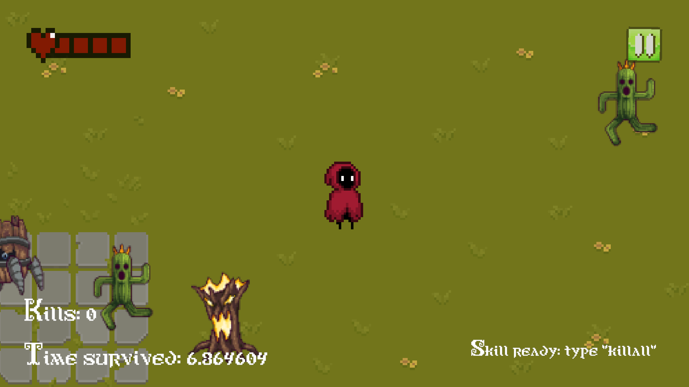
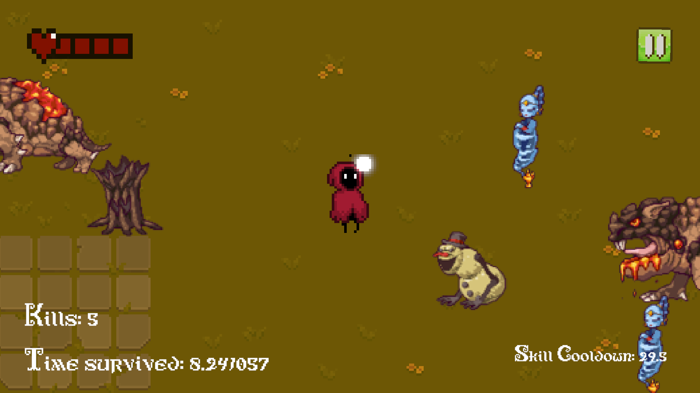
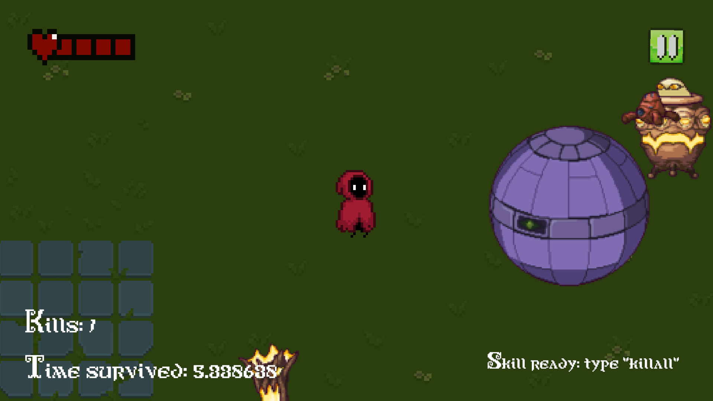
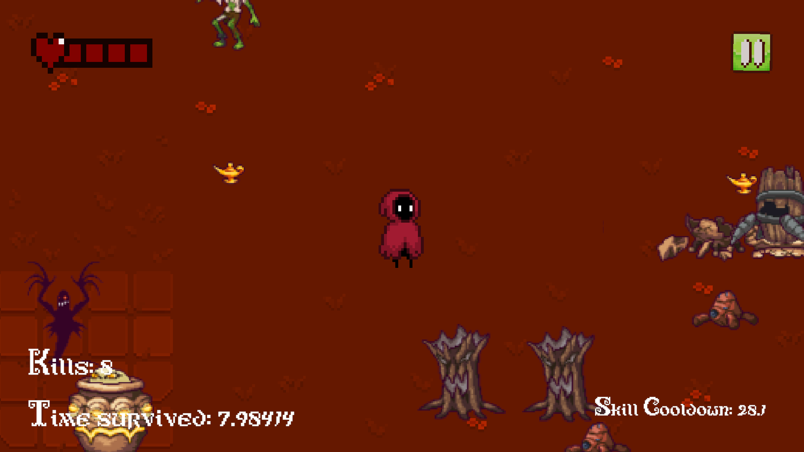

# Magic Wizard Typing Game

## 🧙‍♂️ Overview
**Magic Wizard Typing Game** is an exciting game that tests your typing speed and accuracy. As a wizard, your task is to defeat various monsters by typing their names as quickly as possible before they reach you!

## 🎮 Features
- **Variety of Monsters**: Different enemies with unique names that you must type to defeat.
- **Dynamic Gameplay**: Monsters appear from all directions, making the game more challenging.
- **Engaging Graphics and Sound**: Visual and sound design that adds to the thrill of the game.

## 🕹️ How to Play
1. **Start the game** and you will see the main menu

   
2. Click **Play**. There is 4 kind of difficulties. (Recommended to choose easy mode first)

   

3. This is the monster you will face, **remember their names**!

   
   
4. Once the game start, you will see monsters approaching from different directions. Type the monster's name quickly and press `Enter` to defeat it.
   For example, there's a monster named **Cactuar** approaching! **Type its name and smash enter to defeat it**.
   **Note: All monsters named Cactuar that appear on the screen will be defeated.**
   
   
   

6. Good luck, wizard! Survive until the end!
   

## 🖼️ Gameplay Screenshots
<p>
  
  
  
  
</p>


## 💻 Installation
Follow these steps to install the game on your system:

### Prerequisites
- **Unity 2022.3 or newer**. [Download Unity](https://unity.com/)

### Installation Steps
1. Clone this repository to your computer:

   ```bash
   git clone https://github.com/kvnnh/Magic-Wizard-Typing-Game.git

2. Open **Unity Hub** and click **Add**
3. Select the folder that you cloned this repository

This project is made with unity version 2022.3.37f1
